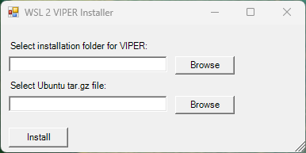
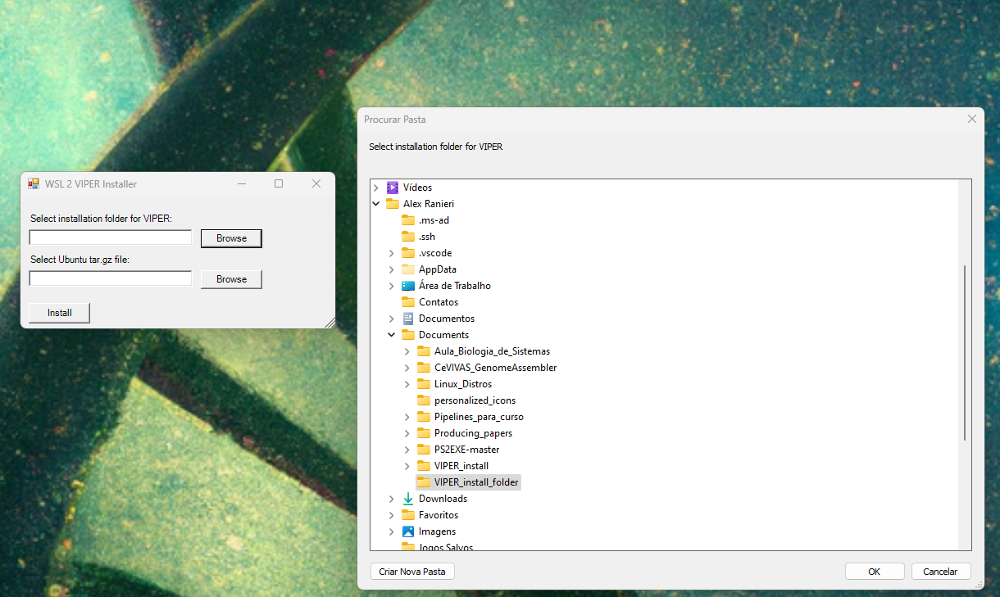
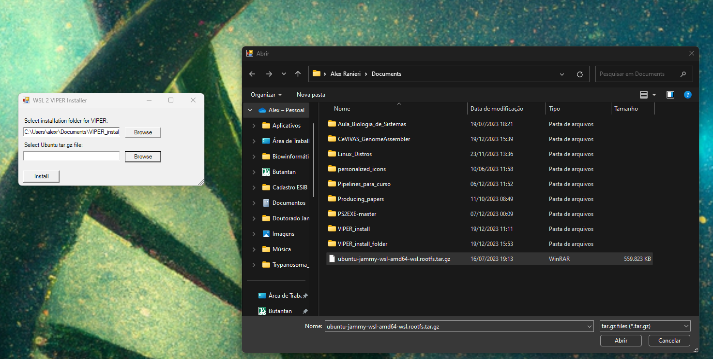
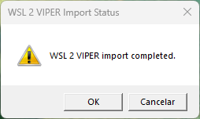
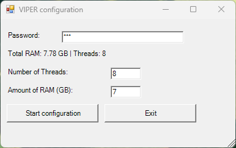
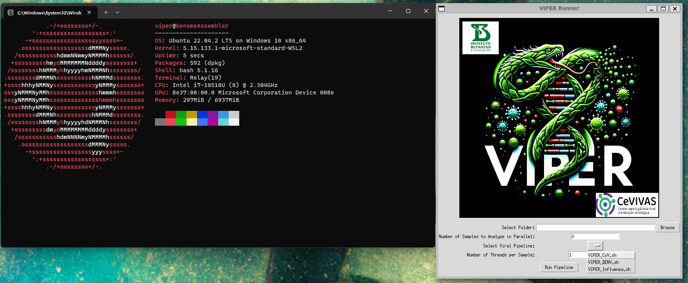
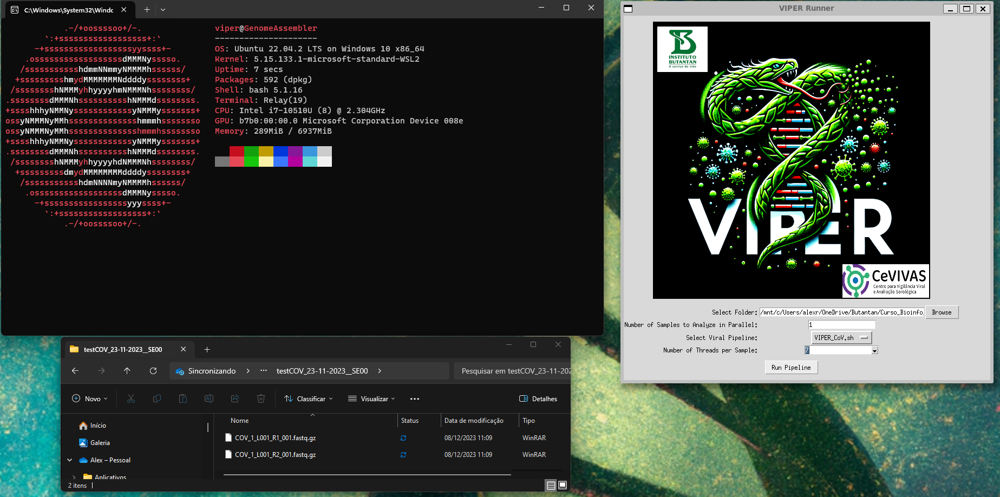
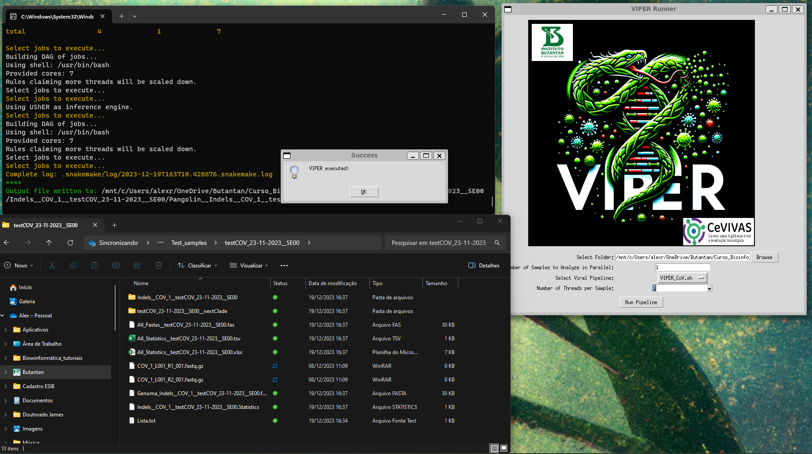
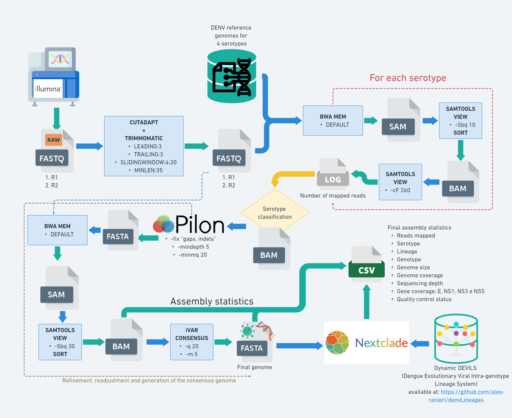

# VIPER - Viral Identification Pipeline for Emergency Response


<br>

VIPER is a user-friendly software for assembling and identifying viral genomes (currently SARS-CoV-2, Dengue, and Influenza), from Illumina sequencing data generated through genomic surveillance. Developed and used by the [CeVIVAS](https://bv.fapesp.br/en/auxilios/110575/continuous-improvement-of-vaccines-center-for-viral-surveillance-and-serological-assessment-cevivas/) bioinformatics team at the Butantan Institute, the name VIPER reflects not only their affiliation but also the symbolism of the snake: vitality, rebirth, renewal, and the very essence of life itself!

You can find the lattest VIPER version on [our lab repository page](https://github.com/V-GEN-Lab/viper)!

What sets VIPER apart?

* Assign Dengue virus sequences to lineages! VIPER use the data provided in [Dynamic DEVILS (Dengue Evolutionary Viral Intra-genotype Lineage System)](https://github.com/alex-ranieri/denvLineages) to determine DENV lineages to assembled sequences. 

* User-friendly GUI: Say goodbye to intimidating command lines! VIPER boasts a intuitive graphical user interface (GUI) that guides you through the entire analysis workflow, making it accessible to users of all experience levels, even those with no prior bioinformatics expertise.

* Powerful and efficient: Don't let large datasets slow you down. VIPER is built for scalability and performance, tackling even the most extensive sequencing data with ease.

* Accurate and precise: Get reliable results you can trust. VIPER leverages cutting-edge algorithms to ensure high-quality viral genome assembly and identification.

* Open-source and customizable: Transparency and flexibility are key. VIPER is an open-source project, allowing you to tailor it to your specific needs and contribute to its ongoing development.

Who can benefit from VIPER?

* Public health researchers: Expedite virus surveillance and outbreak response with rapid and accurate viral genome identification.
* Bioinformaticians: Streamline your viral genomics workflow with an efficient and user-friendly tool.
* Students and educators: Gain valuable hands-on experience in viral genomics with an accessible and comprehensive platform.

VIPER is a constantly evolving and improving software. User feedback is essential to its continued development.

We are always looking for ways to improve VIPER and make it more user-friendly, efficient, and accurate. Your feedback helps us to identify areas where we can make improvements.

If you have any suggestions or feedback, please feel free to share them with us. You can do so by submitting an issue on our GitHub repository, or by contacting us directly.

## Index

* [Install and configuration](#install-and-configuration)
    * [Windows](#windows)
    * [Linux](#linux)
        * [Using the script](#using-the-script)
        * [Using a .yaml file](#using-a-yaml-file)
        * [Configuring the pipeline modules](#configuring-the-pipeline-modules)
* [Usage](#usage)
    * [GUI](#gui)
    * [Command line](#command-line)
* [VIPER pipelines](#viper-pipelines)
    * [SARS-CoV-2 assembly](#sars-cov-2-assembly)
    * [Dengue assembly](#dengue-assembly)
    * [Influenza assembly](#influenza-assembly)
* [Future implementations](#future-implementations)
* [Copyright and licence](#copyright-and-licence)

## Install and configuration

### Windows
#### 1. Requirements
VIPER harnesses the power of the Windows Subsystem for Linux (WSL) to deliver its full functionality. Here's what you need to get your Windows system ready for viral genomics action!

* Windows 10 version 2004 or later (Build 19041 or later) or Windows 11.

* Not sure about your version? Simply type `winver` in the Windows search bar and press Enter to check.
* Using an earlier version? No worries! [Refer to the official Microsoft manual for guidance.](https://learn.microsoft.com/en-us/windows/wsl/install-manual) 

* Approximately 9.9 GB of free disk space.

#### 2. Installing WSL 2

It is recommended to intall WSL 2 through Microsoft Store. 
1. **Launch the Microsoft Store**: Find it on your Start menu or taskbar.
2. **Search for "WSL 2"**: Type it in the search bar and press Enter.
3. **Look for the app with a blue penguin icon.**
4. **Install with a click**: Click the "Get" or "Install" button.
5. **Restart for a fresh start**: After the installation, reboot your computer to ensure everything is set up correctly.

#### 3. Installing VIPER

❗️**Warning**: The antivirus can falsely detect **.exe** files of VIPER as a virus.

**Step 1:** Before proceed with the installation setup, download the [Ubuntu 22.04 Linux image](https://cloud-images.ubuntu.com/wsl/jammy/current/ubuntu-jammy-wsl-amd64-wsl.rootfs.tar.gz) (540 MB of file size), which will serve as the kernel to VIPER.

⚠️ **Caution:** The installation process might result in errors if your user name contains special characters. To avoid that, simply put the VIPER `Windows` folder on your `C:\` drive.

**Step 2:** After the download is complete, go to the `Windows` folder and double-click the **InstallVIPER.exe**. A window will pop-up to select the installation folder for VIPER and to select the downloaded Ubuntu tar.gz file.



<br>

**Step 3:** Browse to select the VIPER installation folder.

<br>


<br>

**Step 4:** Navigate to select the downloaded Ubuntu tar.gz file.

<br>


<br>

**Step 5:** Click in the Install box. After a while a message will inform that the installation (import) was completed.

<br>


<br>

**Step 6:** Set the password for VIPER. It will be exhibited the total amount of RAM and Threads (processors) of the computer that VIPER is being installed. Since VIPER runs in WSL, the user will need to configure the maximum amount of RAM (GB) and Threads that VIPER can use. Make sure to leave some RAM to other Windows processes that might run on your machine. Click in Start configuration when ready.



<br>
The configuration process will depend on the speed of your internet connection and the process can be tracked on the terminal screen. When finished, the terminal will show the VIPER system on WSL:

<br>


<br>
You can close this window and click Exit on the VIPER configuration window.

If any internet connection error occurs during instalation or the process is interrupted (a power loss, for example), please unintall VIPER using the following process:

1. Open PowerShell as an administrator (use the Windows search bar): Right-click on the app icon and select "Run as administrator."
2. Enter the following command:
```
wsl --unregister VIPER
```
This procedure will also serve to fully uninstall VIPER, if needed.

### Linux
VIPER pipelines require a virtual environment configured using Miniconda and Micromamba. There are two ways to configure the VIPER environment:
* **Using a script**: This script will download and install Miniconda and Micromamba, and then create the VIPER environment on the user `home` folder.
* **Using a YAML file**: This method is recommended if you already have Conda or Micromamba installed.
#### Using the script
1. Navigate to the `Linux` folder;
2. Enter the following commands in the terminal:
```
chmod +x minicondaInstallVIPER.sh
./minicondaInstallVIPER.sh
```

Activate the environment using:
```
micromamba activate VIPER
```

#### Using a .yaml file
1. Configure the Conda channels:
```
conda config --add channels conda-forge
conda config --add channels anaconda
conda config --add channels bioconda
conda config --set channel_priority disabled
```
2. Install Micromamba (if you don't have it):
```
conda install -y -c conda-forge micromamba
```
3. Navigate to the `Linux` folder;
4. Install the VIPER environment:
```
micromamba create -y -f VIPER.yml
```
Activate the environment using:
```
micromamba activate VIPER
```
#### Configuring the pipeline modules
1. Copy the `pipelineModules` folder, located under the `Linux` folder, to a directory of your preference;
2. Navigate to the `pipelineModules` folder;
3. Run the `configurePATH.sh` script to export the directory to `$PATH` as `$PIPELINE`:
```
chmod +x configurePATH.sh
./configurePATH.sh
```
4. Export the Executable sh scripts to your `/usr/local/bin/`:
```
sudo ln -s $PIPELINE_PATH/SARS-CoV-2/Exec_COV_assembly_pipeline_Illumina_CeVIVAS.sh /usr/local/bin/VIPER_CoV.sh
sudo ln -s $PIPELINE_PATH/DENV/Exec_DENV_assembly_pipeline_Illumina.sh /usr/local/bin/VIPER_DENV.sh
sudo ln -s $PIPELINE_PATH/Influenza/Exec_FLU_assembly_pipeline_Illumina.sh /usr/local/bin/VIPER_Influenza.sh
```

## Usage

### GUI
* Windows

To run VIPER in GUI mode, execute the file **RunVIPER.exe**, located on the `Windows` folder, with a double-click. You can copy it or make a shortcut. 

* ⚠️ If a visualization glitch occurs, please restart your computer.

* Linux

1. Copy the `viperGUI` folder, located under the `Linux` folder, to a directory of your preference;
2. Navigate to the `viperGUI` folder;
3. Activate the VIPER environment (if not activated):
```
micromamba activate VIPER
```
4. Run the `viperGUI.py` with python:
```
python viperGUI.py
```
* Parameters and input

Currently, VIPER offers a focused set of parameters and inputs to tailor your analysis:

1. **Selecting Your FASTQ Reads:**
* Choose the directory containing your Illumina FASTQ reads (R1 and R2 in **.fastq.gz** format). VIPER will assemble all samples within.

* ⚠️ [Ensure your FASTQ files follow the Illumina naming convention used in BaseSpace.](https://support.illumina.com/help/BaseSpace_Sequence_Hub_OLH_009008_2/Source/Informatics/BS/NamingConvention_FASTQ-files-swBS.htm)
* ⚠️ Make sure to enter the directory while browsing before click 'OK'.

2. **Parallel Power:**

* Optimize CPU usage: Indicate the number of samples VIPER should assemble simultaneously.
* Mind the multiplication: Carefully adjust this parameter in conjunction with the threads per sample (step 4) to manage overall CPU load effectively.

3. **Select the specific viral pipeline best suited for your samples.**
4. **Allocating Threads:**

* Distribute the workload: Specify the number of threads VIPER should dedicate to each sample.
* Balance performance and resources: Strike a balance between analysis speed and overall CPU usage by adjusting this parameter and the number of parallel samples (step 2).
Example: If you set VIPER to assemble 3 samples in parallel, each using 2 threads, the total CPU load will be 6 threads.

<br>



<br>


<br>



<br>

Results will be located on the same directory of the analyzed samples.

<br>



<br>

Test samples for SARS-CoV-2, Dengue and Influenza can be found in `Test_samples` folder.

### Command line
Currently, VIPER offers a focused set of parameters and inputs to tailor your analysis:

1. **Selecting Your FASTQ Reads:**
* Enter the directory containing your Illumina FASTQ reads (R1 and R2 in **.fastq.gz** format). VIPER will assemble all samples within.

* ⚠️ [Ensure your FASTQ files follow the Illumina naming convention used in BaseSpace.](https://support.illumina.com/help/BaseSpace_Sequence_Hub_OLH_009008_2/Source/Informatics/BS/NamingConvention_FASTQ-files-swBS.htm)

2. **Run the viral pipeline best suited for your samples:** 

```
# Activate the environment using:
micromamba activate VIPER

# For SARS-CoV-2:
VIPER_CoV.sh {num_threads} {num_samples}

# For Dengue:
VIPER_DENV.sh {num_threads} {num_samples}

# For Influenza:
VIPER_Influenza.sh {num_threads} {num_samples}
```

* Balance performance and resources: Strike a balance between analysis speed and overall CPU usage by adjusting this parameter and the number of parallel samples.
Example: If you set VIPER to assemble 3 samples in parallel (`{num_samples}`), each using 2 threads (`{num_threads}`), the total CPU load will be 6 threads.

Results will be located on the same directory of the analyzed samples.

## VIPER pipelines

### SARS-CoV-2 assembly


### Dengue assembly



### Influenza assembly


## Future implementations
Shedding New Skin: VIPER's Future Evolution

VIPER's journey is just beginning, with exciting advancements on the horizon:

- [ ] Unlocking advanced options: Unleash greater flexibility for power users with expanded parameter configurations.
- [ ] Shedding light on pipelines: Illuminate each viral pipeline's methodology and capabilities with detailed explanations in the README file.
- [ ] Conquering human monkeypox: Integrate a dedicated module for human monkeypox genome assembly, broadening VIPER's viral repertoire.
- [ ] Intuitive pipeline selection: Empower VIPER to automatically detect the virus from reads and initiate the appropriate pipeline for seamless analysis.
- [ ] Deciphering output: Dive into the secrets of VIPER's output files with clear and informative documentation.
- [ ] Tracking progress: Monitor pipeline execution and troubleshoot potential issues with detailed log files.
- [x] Aesthetic transformation: Infuse VIPER's GUI with visual appeal and intuitive design, making it a joy to navigate and use: changed TKinter to PyQt5!
- [ ] Phylogenetic pursuits: Empower users to delve into the evolutionary relationships of viruses with a phylogenetics analysis module.

## Copyright and licence

VIPER was created by [CeVIVAS](https://bv.fapesp.br/en/auxilios/110575/continuous-improvement-of-vaccines-center-for-viral-surveillance-and-serological-assessment-cevivas/) bioinformatics team at the Butantan Institute:
* Alex Ranieri J. Lima 
* Gabriela Ribeiro
* Vinicius Carius De Souza
* Isabela Carvalho Brcko
* Igor Santana Ribeiro
* James Siqueira Pereira
* Vincent Louis Viala

Suppervised by:
* Maria Carolina Quartim Barbosa Elias Sabbaga
* Sandra Coccuzzo Sampaio 

VIPER is free software: you can redistribute it and/or modify it under the terms of the GNU General Public License as published by the Free Software Foundation, either version 3 of the License, or any later version.

VIPER is distributed in the hope that it will be useful, but **without any warranty; without even the implied warranty of merchantability or fitness for a particular purpose**. See the GNU General Public License for more details: http://www.gnu.org/licenses/.
